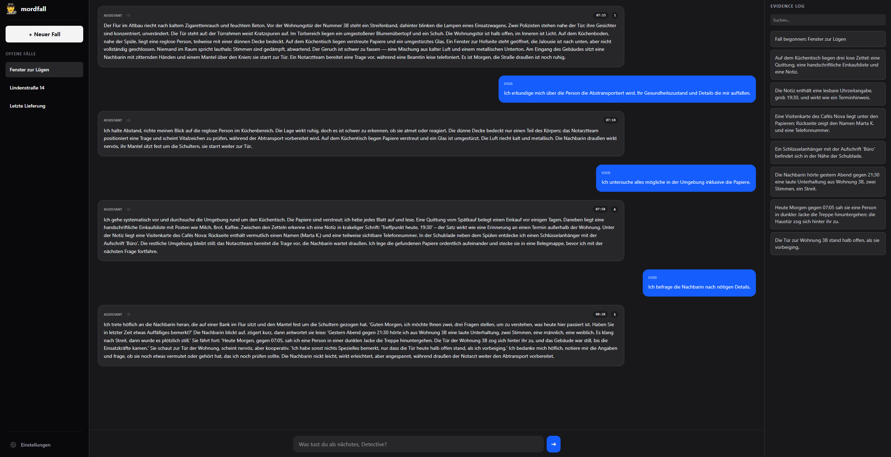

# 🕵️‍♂️ mordfall ai

> **Note:** This project, including its documentation, source code comments, and AI-generated content, is maintained exclusively in **German**.

Dieses Projekt ist ein, KI-gestütztes Detektiv-Rollenspiel. Es nutzt **Bun** als extrem schnelles Backend und **Preact** mit **Tailwind CSS** für ein modernes Frontend. 
Die Besonderheit: Die KI fungiert als Game-Master, der Zeitabläufe verwaltet, Beweise trackt und Zeugen eine Stimme verleiht.



## Features

* **KI-Fall-Generator:** Erstellt komplexe Kriminalfälle mit tiefen Hintergrundgeschichten.
* **Dynamisches Zeit-System:** Die KI berechnet realistisch, wie lange Ermittlungsschritte (z. B. Verhöre, Tatortbegehungen) dauern.
* **Core-Information Tracking:** Wichtige Beweise werden automatisch aus dem Chat extrahiert und in einer Seitenleiste gespeichert.
* **TTS Integration:** Alle Antworten der KI können per Klick über die OpenAI Audio-Schnittstelle vorgelesen werden.
* **SQLite Anbindung:** Alle Fälle und Chatverläufe werden lokal gespeichert und sind jederzeit wieder abrufbar.

---

## Tech-Stack

### Backend

* **Runtime:** [Bun](https://bun.sh)
* **API:** REST (`Bun.serve`)
* **Datenbank:** SQLite (`bun:sqlite`)
* **AI:** OpenAI API (GPT-5-nano für Logik, TTS-1 für Sprache)

### Frontend

* **Framework:** Preact + Vite
* **Styling:** Tailwind CSS

---

## Installation & Setup

### 1. Repository klonen & Dependencies installieren

```bash
# Repository klonen
git clone https://github.com/Shukaaa/mordfall-ai.git
cd mordfall-ai

# Abhängigkeiten installieren für das root-Verzeichnis
npm i

# Abhängigkeiten installieren für das backend und frontend
npm run install:all

```

### 2. Umgebungsvariablen

Erstelle eine `.env` Datei im backend-Verzeichnis:

```env
OPENAI_API_KEY=dein_openai_api_schlüssel
```

### 3. Server starten

Starte das Backend und Frontend
```bash
npm run start:all
```

---

## Gameplay-Loop

1. **Fall erstellen:** Die KI generiert ein Szenario (z. B. "Mord in der Villa").
2. **Ermitteln:** Du schreibst Aktionen in den Chat (z. B. "Ich untersuche das Glas auf dem Tisch").
3. **Zeit vergeht:** Die KI antwortet und sagt dir, wie spät es nach der Aktion ist (z. B. 15 Minuten später).
4. **Beweise sammeln:** Wichtige Infos tauchen rechts im Panel auf, damit du den Überblick nicht verlierst.

> Die Zeit hat einen direkten Einfluss auf den Spielverlauf. Manche Ereignisse können nur zu bestimmten Zeiten stattfinden!

---

## Wichtige Infos

* Dieses Projekt ist ein Experiment und befindet sich in einem frühen Entwicklungsstadium.
* Die KI-Modelle und APIs können sich ändern, was Anpassungen im Code erfordern könnte.
* Die TTS-Funktionalität ist mit Abstand das teuerste Model und könnte pro Nutzung 1-2 Cents kosten.